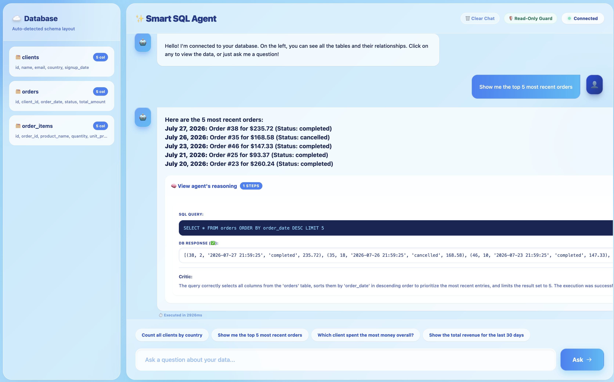
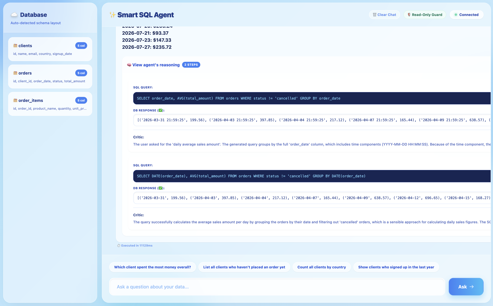
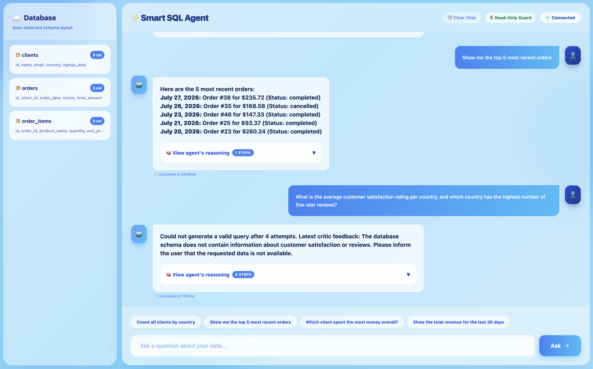
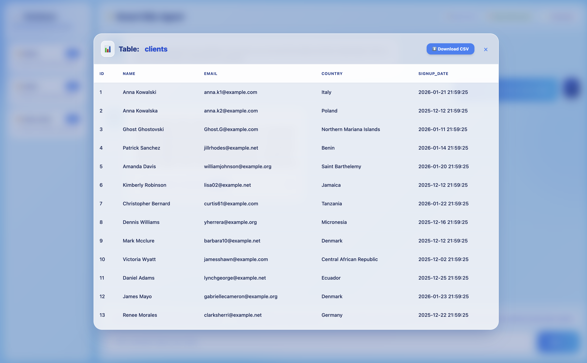
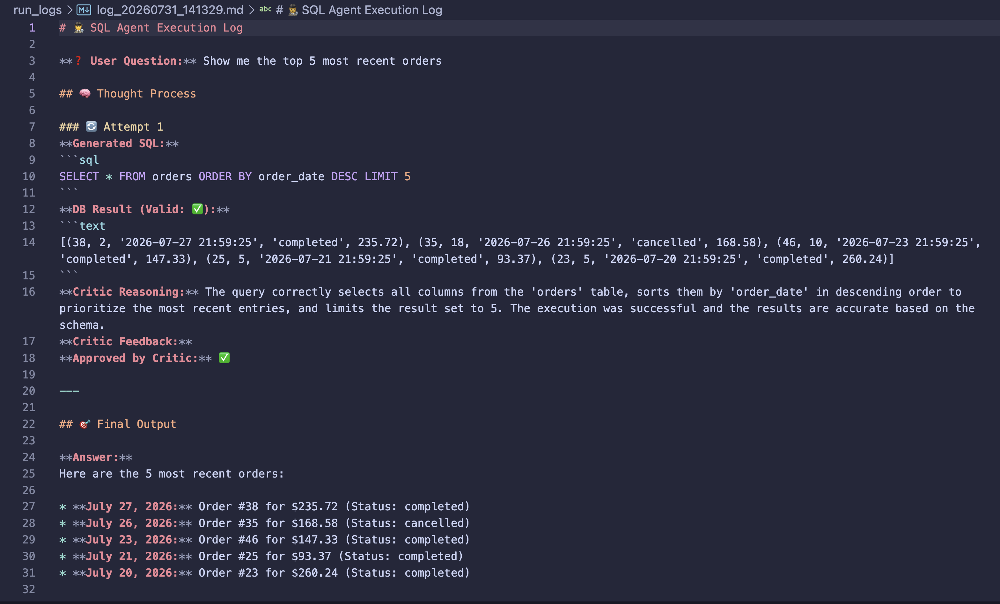
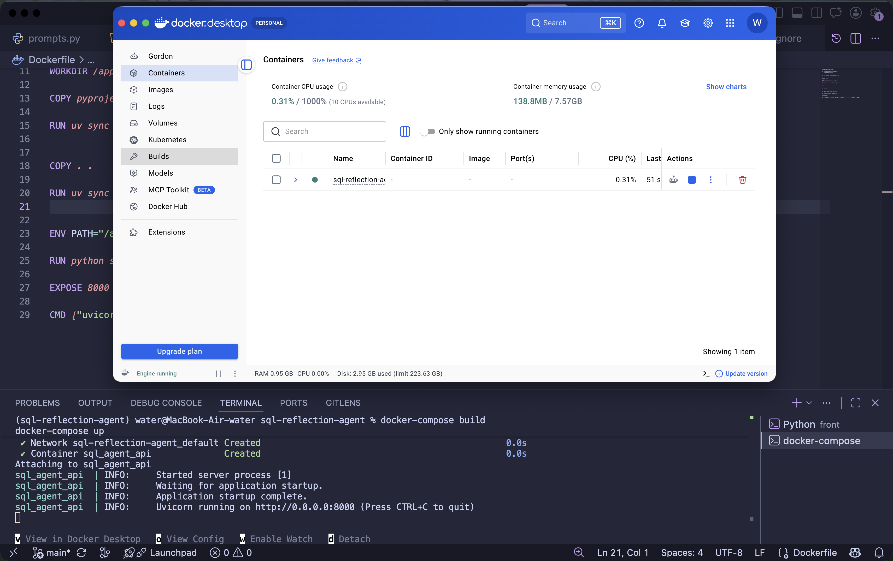

# SQL Reflection Agent

A multi-agent SQL generation system built on **LangGraph**, demonstrating a genuine **reflection / self-correction loop** with an objective, automatic success criterion — not another text-to-SQL wrapper.

Given a natural-language question, an **executor** agent generates a SQL query, which is run against a real SQLite database. A **critic** agent then reviews the query, its execution status, and its result against the original question. If the critic finds a problem, it sends specific feedback back to the executor, which rewrites the query. This repeats up to a configurable attempt limit. The final output is either a working query with a plain-language answer, or an honest failure message after N attempts.

The point of this project isn't SQL generation itself — it's the graph-based reflection pattern: a real conditional loop (executor → critic → executor) driven by LangGraph's conditional edges, not a linear pipeline.

---

## Why this is interesting

Most "agent" demos either don't loop at all, or evaluate success with a fuzzy, subjective LLM judgment. Here, success is grounded in something concrete: **did the query execute, and does its result actually answer the question** — checked by re-running the query against a real database, not by asking a model to grade itself in the abstract.

The test database is deliberately seeded with traps designed to break naive text-to-SQL: clients with near-identical names, orders with no matching client, a client with zero orders, a client whose every order was cancelled, order totals that don't match the sum of their line items (shipping/discount), and dates spanning several months. These aren't edge cases the agent is told about — they're exactly the kind of ambiguity a critic has to catch by reasoning about the result, not just checking whether the query ran.

---

## Architecture

```
START → generate (executor) → execute (run SQL) → critic
                                                       │
                              ┌────────────────────────┼─────────────────────────┐
                              ▼                         ▼                         ▼
                        approved                  retry (feedback            attempts
                              │                    sent to executor)          exhausted
                              ▼                         │                         ▼
                      formulate_answer ◄─────────────────┘                 formulate_error
                              │                                                    │
                              └─────────────────────► END ◄────────────────────────┘
```

Three LLM roles, each with a single responsibility and its own system prompt:

- **Executor** — generates a SQL query from the question, the live DB schema, and (on retries) the previous query + critic feedback.
- **Critic** — evaluates the query + result against the question. Explicitly reasons step-by-step before returning a structured verdict (`is_approved`, `feedback`), so it doesn't just check "did it run" but also "is an empty result actually correct here, or does it hide a mistake."
- **Formulate-answer** — turns an approved result into a natural-language answer for the end user, without ever mentioning SQL or databases.

State is shared across the graph via a `TypedDict`; the attempt history uses a LangGraph reducer (`Annotated[list, operator.add]`) so each retry appends to, rather than overwrites, the run's history — this is what powers the full reasoning trail shown in the UI and in the saved run logs.

---

## Tech stack

- **Python 3.12**, `uv` for dependency management, src-layout
- **LangGraph** — graph orchestration, conditional edges, cyclic reflection loop
- **Gemini API** (`google-genai`) — structured output (Pydantic `response_schema`) for the critic's verdict
- **FastAPI** — backend API (`/api/chat`, `/api/schema`, `/api/data/{table}`)
- **SQLite** — seeded test database (clients / orders / order_items) with `Faker`-generated data and hand-placed edge cases
- **Vanilla HTML/CSS/JS** frontend — no framework, `marked.js` for rendering markdown answers
- **pytest** + `unittest.mock` — every node fully tested with mocked LLM calls, no real API calls in CI
- **Docker** — containerized API, DB seeded at build time
- **GitHub Actions** — `ruff` + `pytest` on every push

---

## Project structure

```
src/sql_reflection_agent/
├── state.py        # SQLAgentState (TypedDict) + CriticVerdict (Pydantic)
├── graph.py         # StateGraph assembly, conditional routing
├── nodes.py          # generate / execute / critic / formulate_answer / formulate_error
├── prompts.py         # system prompts for all three LLM roles
├── db.py               # SQLite access: execute_sql, get_schema, get_table_data
└── reporting.py          # writes each run's full reasoning trail to run_logs/*.md
scripts/
├── seed_db.py       # generates the seeded test database
├── run_agent.py      # CLI entry point for manual testing
└── api.py              # FastAPI app
front/
└── index.html        # chat UI
tests/                  # pytest, mocked LLM calls
```

---

## Running it

**Locally:**
```bash
uv sync
uv run python scripts/seed_db.py
uv run uvicorn scripts.api:app --reload
```
Then open `front/index.html` in a browser (or serve it: `python3 -m http.server 5500` from `front/`).

**With Docker:**
```bash
docker-compose up --build
```
The database is generated at build time (fixed seed, fully deterministic) and baked into the image.

**Tests:**
```bash
uv run pytest -v
```
All LLM calls are mocked — no API key needed to run the test suite.

---

## Example

> **Q:** "How many users placed orders totaling more than 3 items?"

Attempt 1 generates a query using `GROUP BY` + `HAVING`, which returns one row per matching client instead of a single count. The critic catches this — the result technically ran without error, but doesn't answer "how many" — and sends specific feedback. Attempt 2 wraps the query in a subquery and gets approved. The full reasoning for both attempts is preserved in the UI and in the saved log file, not just the final answer.

---

## Screenshots

### 1. Chat UI — successful answer


A single-attempt question answered directly — the executor got the query right on the first try, the critic approved it, and the answer is shown in plain language.

### 2. Reflection loop in action — multi-attempt retry


The reasoning trail expanded for a question that took multiple attempts: the first query was rejected by the critic with specific feedback, the executor rewrote it, and the second attempt was approved. This is the core of the project — a real self-correction loop, not just an agent that answers on the first try.

### 3. Failure case — honest "couldn't solve it" message


A question with no matching data in the schema, exhausting the attempt limit. The agent reports failure honestly instead of hallucinating an answer.

### 4. Table browser sidebar


Raw rows from one of the seeded tables, including the deliberately near-duplicate "Anna Kowalski" / "Anna Kowalska" clients used to test entity confusion.

### 5. Saved run log (markdown)


A generated `run_logs/*.md` file — the full attempt-by-attempt audit trail (SQL, DB result, critic reasoning, critic feedback) for one session, independent of the UI.

### 6. Docker + CI


`docker-compose up` running the containerized API — the project builds and deploys as a self-contained service, not just a local script.

---

## What this deliberately doesn't do (yet)

This is a read-only, single-query-per-question system by design — the executor only ever runs `SELECT` statements, and each question resolves to one SQL query (possibly rewritten across retries), not a multi-step plan. A planner-agent architecture (decomposing complex questions into sub-tasks, with separate read/write-capable executors) was considered and deliberately deferred until this simpler, safer version was fully working end-to-end — extending into that is a natural next step, not an oversight.